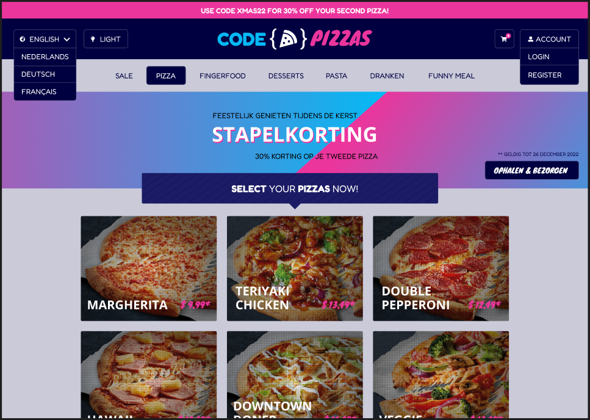

# CodePizzas
This project was generated with [Angular CLI](https://github.com/angular/angular-cli) version 15.0.4.

## Design
This project is created based on a custom design [available in Figma](https://www.figma.com/file/g8A1SzbDgXZ9IbtNN8smY5/Website?node-id=0%3A1&t=AWNDFby65g3UhwpR-1).

## Libraries
- [FortAwesome](https://github.com/FortAwesome/angular-fontawesome)
- [Tailwindcss](https://tailwindcss.com/)

## References
- [Angular Basics: Tips for Structuring Your Angular Project](https://www.telerik.com/blogs/angular-basics-tips-structuring-angular-project)
- [How to setup 404 page in angular routing?](https://www.geeksforgeeks.org/how-to-setup-404-page-in-angular-routing/)
- [New York Pizza](https://www.newyorkpizza.nl/)

## Authors
- [Tjeu Foolen](https://github.com/tjeufoolen)
